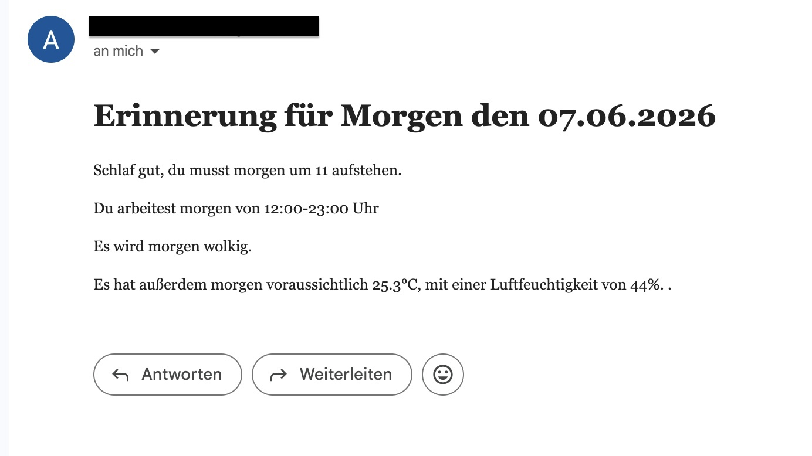
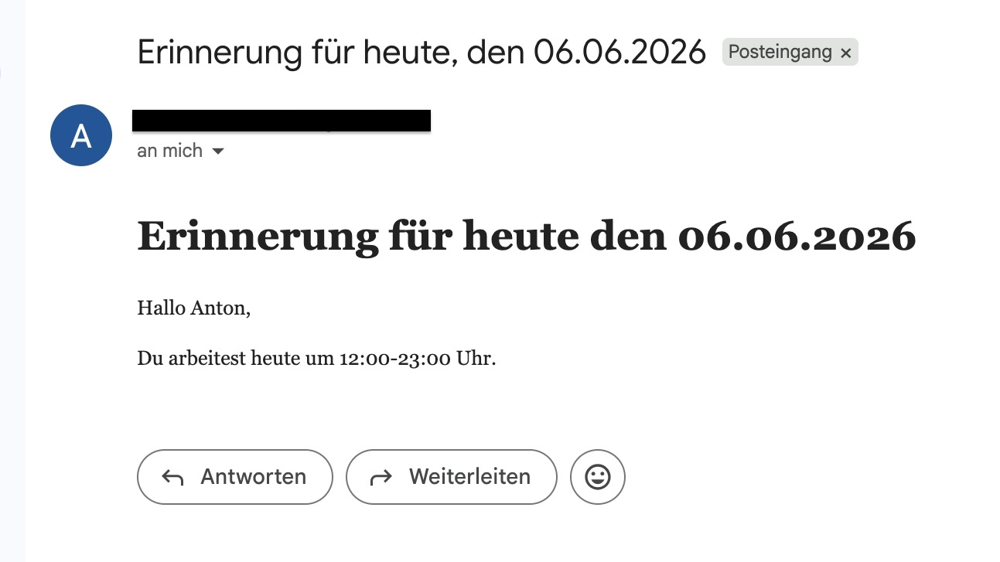

# SCHICHTPLAN_TOOL - Everything you need to know

## What does SCHICHTPLAN_TOOL do?

SCHICHTPLAN_TOOL extracts working times (time and date pairs) from schichten.txt.
Two automatic emails will be sent every workday. One at 10 pm, including your worktime the following day and features like the weather.
The second one reminds you of your shift time on the morning of your workday.

## How can I automate the programm?

1. Clone the repository
2. Install dependencies from requirements.txt
3. Fill out schichten.txt (work time and date)
4. Fill out example.env, change ist to .env
5. Run program daily automatically with:
**Mac** / **Linux:** Use cron job:
--> For a tutorial visit <https://www.youtube.com/watch?v=QZJ1drMQz1A&t=67s>
**Windows:** Use Task Scheduler:
--> For a tutorial visit <https://www.youtube.com/watch?v=DVUlkU2AxgQ>

## Screenshots

First email (evening):

Second email:

## Planned Features

1. individual configuration via browser app
