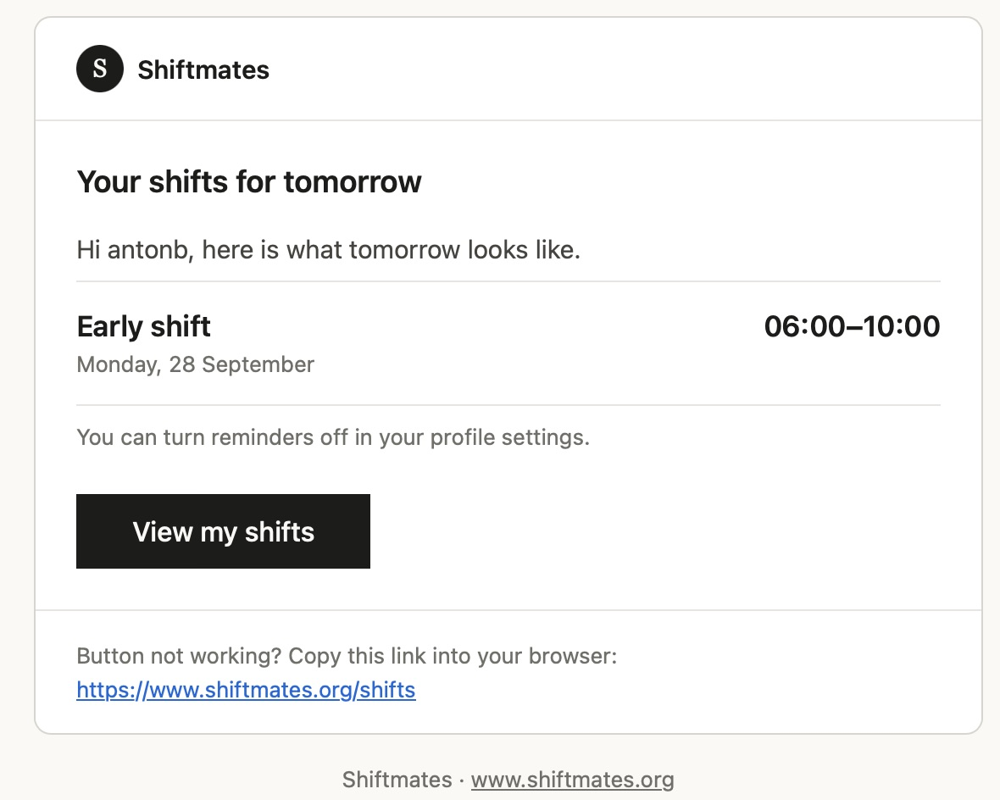
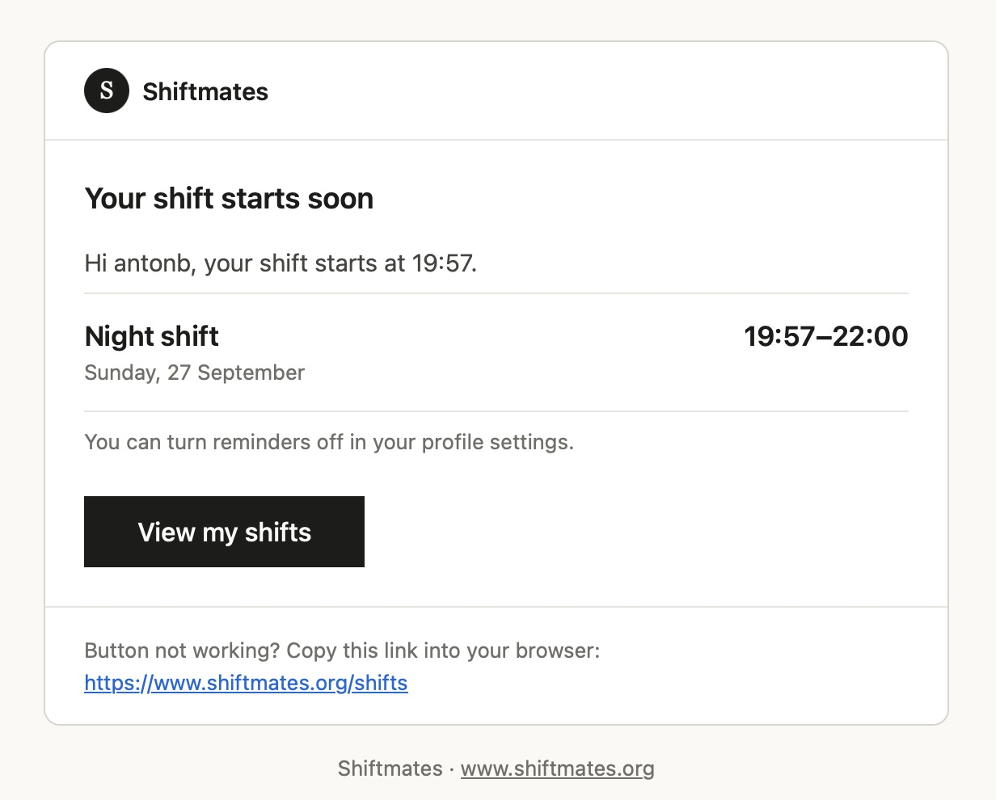

# Shiftmates

Email reminders for your work shifts. Save your roster once — the app mails
you the evening before and again shortly before the shift starts.

**Live:** [www.shiftmates.org](https://www.shiftmates.org)


I built it because I worked rotating shifts and kept checking the plan on my
phone at 11pm.

## Features

- Sign up with an email address, confirmed through a verification link; tokens expire after one hour
- Passwords hashed with bcrypt; login locks for 15 minutes after 5 failed attempts
- Password reset via a token that also expires after one hour
- Add shifts with a start and end time, or mark a date as a day off — overnight shifts roll over to the next day automatically
- Four built-in shift types, or name your own; optional note per shift
- Daily reminder at a time you choose (18:00 by default), shift reminder 30–180 minutes before the start
- A background worker sends both reminders in each user's own timezone and never sends the same mail twice
- Days off get a short all-clear mail, so a quiet inbox never means a missed shift
- Turn either reminder off on its own, or both at once from the app
- Enter several days at once by tapping them in a month calendar, and save a shift as a reusable template (name, colour, times)
- Try it without an account at `/testen` — a browser-only demo that stores nothing
- Teams: a shift lead creates a team, members join with a short code, the lead sees and edits their shifts, and every change mails the affected person
- When the lead adds or changes a shift, the member confirms it with one click via a signed link (no login), and the lead sees the confirmation status

## Screenshots

| Daily reminder (evening before) | Shift reminder (same day) |
|---|---|
|  |  |

## Tech

| Layer | Choice |
|---|---|
| Web | Flask, Jinja2, gunicorn |
| Data | PostgreSQL in production, SQLite locally, SQLAlchemy + Alembic |
| Auth | bcrypt, Flask-WTF (CSRF), signed cookie sessions |
| Jobs | Separate worker process, deduplicated via sent-at timestamps |
| Email | Resend API, hand-written table-based HTML |
| Hosting | Railway, custom domain with SPF, DKIM and DMARC |

## Architecture

Two processes run side by side, defined in the `Procfile`:

- **web** — the Flask app. Applies migrations on boot, then serves requests.
- **worker** — checks every minute which reminders are due: shift reminders
  inside their lead-time window, daily reminders once the user's chosen time
  has passed in their timezone.

They share the database but never call each other. The worker runs without a
request context, so everything it needs is passed in explicitly — an early
version read `request.form` inside a helper the worker called, which meant no
reminder was ever sent.

Two details that took a few attempts to get right:

- **Send first, stamp after.** A reminder is marked as sent only after the
  mail API confirms delivery. If sending fails, the next run retries; the
  worst case is a late mail, never a missing one.
- **Windows instead of exact times.** Reminders match against a time window
  rather than an exact minute, so a slow or restarted worker cannot skip past
  a due reminder.

## Running it locally

```bash
python -m venv .venv
source .venv/bin/activate
pip install -r requirements.txt

cp example.env .env      # then fill in your own values
flask db upgrade         # creates the local SQLite database
python app.py            # http://localhost:5555
```

To send reminders, run the worker in a second terminal:

```bash
python worker.py
```

## Environment variables

| Variable | Purpose |
|---|---|
| `secret_key` | Signs the session cookie. Any long random string. |
| `resend_api_key` | API key from resend.com |
| `DATABASE_URL` | Postgres URL. Falls back to local SQLite if unset. |
| `SESSION_COOKIE_SECURE` | `true` when serving over HTTPS |
| `FLASK_DEBUG` | `true` during development only |

## Roadmap

- Mark vacation / absence, visible to the team lead
- Recurring shift patterns (e.g. 4-on / 4-off) entered once instead of day by day
- A more reliable delivery channel (WhatsApp or SMS) alongside email

## Notes

Built as a personal side project while working full-time, before starting a
Business Informatics degree.

## License

MIT
